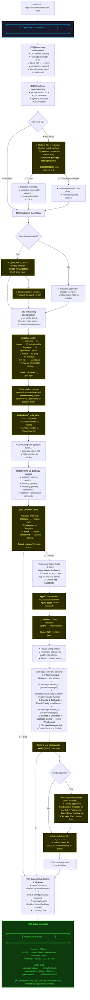

# install.sh Interactive Installation UI Flow

```mermaid
graph TD
    Start["curl -fsSL https://install9.ai/openclaw | bash"] --> Banner

    Banner["╔══════════════════════════════════════════╗
    ║  OpenClaw — Installer v1.1.0             ║
    ╚══════════════════════════════════════════╝"]

    Banner --> P1

    P1["<b>[1/8] Detecting environment</b>
    ▸ OS: darwin (arm64)
    ▸ Package manager: brew
    ▸ Shell: zsh → ~/.zshrc
    ▸ Init system: launchd
    ▸ OpenClaw not found — will install"]

    P1 --> P2

    P2["<b>[2/8] Checking dependencies</b>
    ✔ git: git version 2.x.x
    ✔ curl: available
    ✔ openssl: available
    ✔ jq: available"]

    P2 --> NodeCheck{Node.js ≥ 22?}

    NodeCheck -->|"✔ Installed"| P3
    NodeCheck -->|"✖ Not found"| NodePrompt

    NodePrompt["▸ Node.js 22+ is required. Choose install method:
      1) <b>nvm</b> (recommended, user-space)
      2) <b>System package manager</b> (brew)

    <b>Select [1/2]</b> [1]: <i>User enters 1 or 2</i>"]

    NodePrompt -->|"1 → nvm"| NvmInstall["▸ Installing nvm first...
    ▸ Installing Node.js 22 via nvm...
    ✔ Node.js installed: v22.x.x"]
    NodePrompt -->|"2 → Package manager"| PkgInstall["▸ Installing node@22 via brew...
    ✔ Node.js installed: v22.x.x"]

    NvmInstall --> P3
    PkgInstall --> P3

    P3["<b>[3/8] Installing OpenClaw</b>"]
    P3 --> OcExists{OpenClaw installed?}

    OcExists -->|"No"| OcInstall["▸ Installing openclaw globally via npm...
    ✔ OpenClaw 2026.x.x installed"]
    OcExists -->|"Yes"| OcUpgrade

    OcUpgrade["✔ OpenClaw 2026.x.x already installed
    <b>Check for updates?</b> [Y/n]: <i>User input</i>"]

    OcUpgrade -->|Y| OcUpgradeCheck["▸ Checking latest version...
    ✔ Already on latest version"]
    OcUpgrade -->|n| P4

    OcUpgradeCheck --> P4
    OcInstall --> P4

    P4["<b>[4/8] Initializing configuration</b>
    ▸ No config found. Running initial setup...
    ✔ Minimal config created"]

    P4 --> ModelSetup

    ModelSetup["<b>Model provider</b>:
      1) anthropic    2) openai       3) openai-codex
      4) google       5) openrouter   6) xai
      7) mistral      8) groq         9) minimax
      10) zai         11) ollama      12) openai-compatible
      s) Skip

    <b>Select provider</b> [1]: <i>User input</i>"]

    ModelSetup --> ModelName["ℹ Other models: claude-opus-4-6, claude-haiku-4-5
    <b>Model name</b> [claude-sonnet-4-6]: <i>User enters or presses Enter</i>"]

    ModelName --> ApiKey["<b>ANTHROPIC_API_KEY</b>: <i>******** (masked)</i>
    ✔ API key written to ~/.zshrc
    ✔ API key written to ~/.openclaw/.env"]

    ApiKey --> GatewayToken["▸ Generating new gateway token...
    ✔ Gateway token: set
    ✔ Token written to ~/.zshrc"]

    GatewayToken --> P5

    P5["<b>[5/8] Setting up gateway service</b>
    ▸ Installing gateway service...
    ▸ Starting gateway...
    ▸ Verifying gateway connection...
    ✔ Gateway: running and connected"]

    P5 --> P6

    P6["<b>[6/8] Channel setup</b>

    Available channels:
      1) <b>feishu</b>   — Feishu / Lark
      2) <b>telegram</b> — Telegram
      3) <b>slack</b>    — Slack
      4) <b>discord</b>  — Discord
      s) Skip

    <b>Select channel</b> [1]: <i>User input</i>"]

    P6 -->|"s → Skip"| P7
    P6 -->|"1 → feishu"| FeishuSetup

    FeishuSetup["Feishu App Setup Guide:
      1. Go to <b>https://open.feishu.cn</b>
      2. Create an app → get App ID and App Secret
      3. Enable <b>bot capability</b>"]

    FeishuSetup --> FeishuInput

    FeishuInput["<b>App ID</b>: <i>User enters cli_xxxxxxxxxxxxxxxx</i>
    <b>App Secret</b>: <i>******** (masked)</i>"]

    FeishuInput --> FeishuDomain

    FeishuDomain["  1) <b>feishu</b> — China mainland
      2) <b>lark</b>   — International

    <b>Select [1/2]</b> [1]: <i>User input</i>"]

    FeishuDomain --> FeishuSave["✔ Feishu config written
    ▸ Restarting gateway to load Feishu plugin...
    ✔ Feishu channel: active"]

    FeishuSave --> FeishuNextSteps

    FeishuNextSteps["Next steps in Feishu console:
      1. <b>Permissions & Scopes</b> — add scopes:
         • im:message.receive_v1 (receive messages)
         • contact:contact.base:readonly (resolve sender names)
      2. <b>Events & Callbacks > Event Config</b> — add event:
         • im.message.receive_v1 (receive messages)
      3. <b>Events & Callbacks > Callback Config</b> — select <b>WebSocket</b>
      4. <b>Version Management</b> > Create Version > Publish"]

    FeishuNextSteps --> FeishuTest

    FeishuTest["<b>Send a test message to verify?</b> [Y/n]: <i>User input</i>"]

    FeishuTest -->|n| P7
    FeishuTest -->|Y| FeishuPairing

    FeishuPairing{Pending pairing?}

    FeishuPairing -->|"Yes"| FeishuAutoApprove["ℹ Auto-approving pairing code: AQ26XKCJ
    ✔ Pairing approved. Send another message to your bot in Feishu now.
    <b>Press Enter to retry, or 's' to skip</b>: <i>User presses Enter</i>"]
    FeishuPairing -->|"No"| FeishuOpenId

    FeishuAutoApprove --> FeishuOpenId

    FeishuOpenId["ℹ Detected Open ID: ou_xxxxxxxx
    <b>Confirm Open ID</b> [ou_xxx]: <i>User confirms or enters</i>"]

    FeishuOpenId --> FeishuTestResult["✔ Test message sent! Check Feishu."]

    FeishuTestResult --> P7

    P7["<b>[7/8] Security hardening & cleanup</b>
    ✔ denyCommands: cleaned up invalid entries
    ✔ tools.fs.workspaceOnly: enabled
    ✔ memorySearch: disabled (no embedding provider)
    ✔ 3 issue(s) fixed"]

    P7 --> P8

    P8["<b>[8/8] Setup complete</b>

    ╔══════════════════════════════════════════╗
    ║  OpenClaw is ready!                      ║
    ╚══════════════════════════════════════════╝

    Version:   2026.x.x
    Config:    ~/.openclaw/openclaw.json
    Channels:  feishu
    Gateway:   ws://127.0.0.1:18789

    Quick start:
      openclaw status         # Health check
      openclaw logs --follow  # Live logs
      openclaw tui            # Terminal chat UI

    ▶ Dashboard:  http://127.0.0.1:18789/#token=xxx...
    ✔ Dashboard opened in browser"]

    style Banner fill:#1a1a2e,color:#00d4ff,stroke:#00d4ff
    style P8 fill:#0d3b0d,color:#4eff4e,stroke:#4eff4e
    style NodePrompt fill:#2d2d00,color:#ffff66,stroke:#ffff66
    style ModelSetup fill:#2d2d00,color:#ffff66,stroke:#ffff66
    style ModelName fill:#2d2d00,color:#ffff66,stroke:#ffff66
    style ApiKey fill:#2d2d00,color:#ffff66,stroke:#ffff66
    style FeishuInput fill:#2d2d00,color:#ffff66,stroke:#ffff66
    style FeishuDomain fill:#2d2d00,color:#ffff66,stroke:#ffff66
    style FeishuTest fill:#2d2d00,color:#ffff66,stroke:#ffff66
    style FeishuOpenId fill:#2d2d00,color:#ffff66,stroke:#ffff66
    style FeishuAutoApprove fill:#2d2d00,color:#ffff66,stroke:#ffff66
    style OcUpgrade fill:#2d2d00,color:#ffff66,stroke:#ffff66
    style OcUpgradeCheck fill:#2d2d00,color:#ffff66,stroke:#ffff66
    style P6 fill:#2d2d00,color:#ffff66,stroke:#ffff66
```
