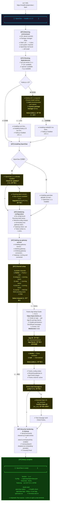

# install.sh 交互式安装 UI 流程

```mermaid
graph TD
    Start["curl -fsSL https://install9.ai/openclaw | bash"] --> Banner

    Banner["╔══════════════════════════════════════════╗
    ║  OpenClaw — Installer v1.1.0             ║
    ╚══════════════════════════════════════════╝"]

    Banner --> P0

    P0["<b>[0/7] Detecting environment</b>
    ▸ OS: darwin (arm64)
    ▸ Package manager: brew
    ▸ Shell: zsh → ~/.zshrc
    ▸ Init system: launchd
    ▸ OpenClaw not found — will install"]

    P0 --> P1

    P1["<b>[1/7] Checking dependencies</b>
    ✔ git: git version 2.x.x
    ✔ curl: available
    ✔ openssl: available
    ✔ jq: available"]

    P1 --> NodeCheck{Node.js ≥ 22?}

    NodeCheck -->|"✔ 已安装"| P2
    NodeCheck -->|"✖ 未安装"| NodePrompt

    NodePrompt["▸ Node.js 22+ is required. Choose install method:
      1) <b>nvm</b> (recommended, user-space)
      2) <b>System package manager</b> (brew)

    <b>Select [1/2]</b> [1]: <i>用户输入 1 或 2</i>"]

    NodePrompt -->|"1 → nvm"| NvmInstall["▸ Installing nvm first...
    ▸ Installing Node.js 22 via nvm...
    ✔ Node.js installed: v22.x.x"]
    NodePrompt -->|"2 → 包管理器"| PkgInstall["▸ Installing node@22 via brew...
    ✔ Node.js installed: v22.x.x"]

    NvmInstall --> P2
    PkgInstall --> P2

    P2["<b>[2/7] Installing OpenClaw</b>"]
    P2 --> OcExists{OpenClaw 已安装?}

    OcExists -->|"否"| OcInstall["▸ Installing openclaw globally via npm...
    ✔ OpenClaw 1.x.x installed"]
    OcExists -->|"是"| OcUpgrade

    OcUpgrade["✔ OpenClaw 1.x.x already installed
    <b>Check for updates?</b> [Y/n]: <i>用户输入</i>"]

    OcUpgrade -->|Y| OcUpgradeCheck["▸ Checking latest version...
    ▸ New version available: 1.x.x
    <b>Upgrade to 1.x.x?</b> [Y/n]: <i>用户输入</i>"]
    OcUpgrade -->|n| P3

    OcUpgradeCheck --> P3
    OcInstall --> P3

    P3["<b>[3/7] Initializing configuration</b>
    ▸ No config found. Running initial setup...
    ✔ Minimal config created
    ▸ Generating new gateway token...
    ✔ Gateway token: set
    ✔ Token written to ~/.zshrc"]

    P3 --> P4

    P4["<b>[4/7] Setting up gateway service</b>
    ▸ Installing gateway service...
    ▸ Starting gateway...
    ▸ Verifying gateway connection...
    ✔ Gateway: running and connected"]

    P4 --> P5

    P5["<b>[5/7] Channel setup</b>

    Available channels:
      1) <b>feishu</b>  — Feishu / Lark
      2) telegram — (coming soon)
      3) slack    — (coming soon)
      4) discord  — (coming soon)
      5) wechat   — WeChat Work (coming soon)
      s) Skip

    <b>Select channel</b> [1]: <i>用户输入</i>"]

    P5 -->|"s → 跳过"| P6
    P5 -->|"1 → feishu"| FeishuSetup

    FeishuSetup["Feishu App Setup Guide:
      1. Go to <b>https://open.feishu.cn</b>
      2. Create an app → get App ID and App Secret
      3. Enable permissions: Send/Read messages
      4. Events: Use <b>WebSocket</b> mode"]

    FeishuSetup --> FeishuInput

    FeishuInput["<b>App ID</b>: <i>用户输入 cli_xxxxxxxxxxxxxxxx</i>
    <b>App Secret</b>: <i>用户输入（密码隐藏）</i>"]

    FeishuInput --> FeishuDomain

    FeishuDomain["  1) <b>feishu</b> — China mainland
      2) <b>lark</b>   — International

    <b>Select [1/2]</b> [1]: <i>用户输入</i>"]

    FeishuDomain --> FeishuSave["✔ Feishu config written
    ▸ Restarting gateway to load Feishu plugin...
    ✔ Feishu channel: active"]

    FeishuSave --> FeishuTest

    FeishuTest["<b>Send a test message to verify?</b> [Y/n]: <i>用户输入</i>"]

    FeishuTest -->|n| P6
    FeishuTest -->|Y| FeishuOpenId

    FeishuOpenId["▸ Detected Open ID: ou_xxxxxxxx
    <b>Confirm Open ID</b> [ou_xxx]: <i>用户确认或输入</i>"]

    FeishuOpenId --> FeishuTestResult["✔ Test message sent! Check Feishu."]

    FeishuTestResult --> P6

    P6["<b>[6/7] Security hardening & cleanup</b>
    ✔ denyCommands: cleaned up invalid entries
    ✔ tools.fs.workspaceOnly: enabled
    ✔ memorySearch: disabled (no embedding provider)
    ✔ 3 issue(s) fixed"]

    P6 --> P7

    P7["<b>[7/7] Setup complete</b>

    ╔══════════════════════════════════════════╗
    ║  OpenClaw is ready!                      ║
    ╚══════════════════════════════════════════╝

    Version:   1.x.x
    Config:    ~/.openclaw/openclaw.json
    Channels:  feishu
    Gateway:   ws://127.0.0.1:18789

    Quick start:
      openclaw status         # Health check
      openclaw logs --follow  # Live logs
      openclaw tui            # Terminal chat UI

    ⚠ Important: Run source ~/.zshrc or open a new terminal"]

    style Banner fill:#1a1a2e,color:#00d4ff,stroke:#00d4ff
    style P7 fill:#0d3b0d,color:#4eff4e,stroke:#4eff4e
    style NodePrompt fill:#2d2d00,color:#ffff66,stroke:#ffff66
    style FeishuInput fill:#2d2d00,color:#ffff66,stroke:#ffff66
    style FeishuDomain fill:#2d2d00,color:#ffff66,stroke:#ffff66
    style FeishuTest fill:#2d2d00,color:#ffff66,stroke:#ffff66
    style FeishuOpenId fill:#2d2d00,color:#ffff66,stroke:#ffff66
    style OcUpgrade fill:#2d2d00,color:#ffff66,stroke:#ffff66
    style OcUpgradeCheck fill:#2d2d00,color:#ffff66,stroke:#ffff66
    style P5 fill:#2d2d00,color:#ffff66,stroke:#ffff66
```
